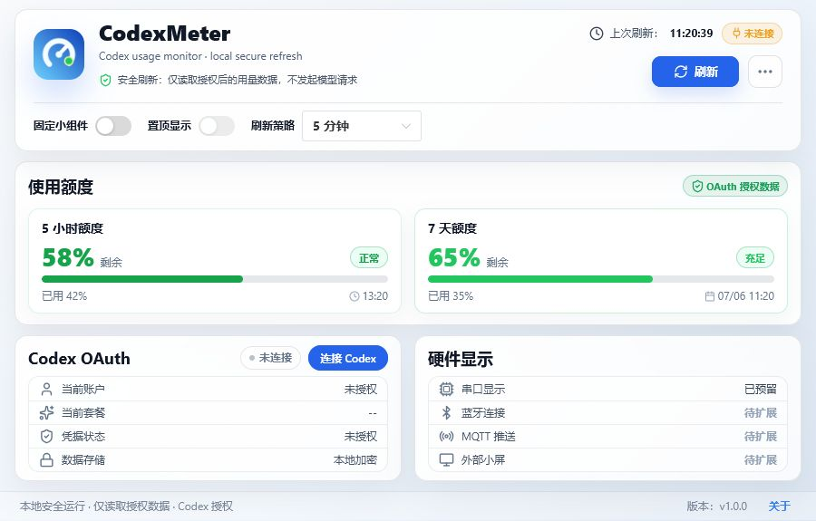
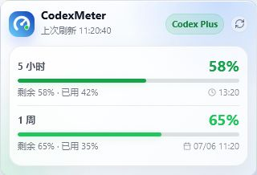

# CodexMeter

本地运行的 Codex 用量监控桌面工具。它用更直观的方式展示 5 小时额度、7 天额度、重置卡和当前套餐，并提供一个可固定在桌面的轻量小组件。



## 适合谁

- 经常使用 Codex / ChatGPT Codex，想随时知道额度还剩多少
- 想学习 Electron + Vue 3 + TypeScript 桌面应用结构
- 想了解 OAuth 授权数据、本地安全存储、桌面小组件这类实现方式
- 想把额度状态后续同步到串口屏、蓝牙屏、MQTT 或其它硬件设备

## 功能

- 5 小时额度和 7 天额度监控
- 充足、正常、关注、紧张、预警、已耗尽 6 档状态提示
- 重置时间显示，主窗口和小组件保持一致
- Codex Plus 等套餐信息显示
- OAuth 授权读取用量数据
- 可固定主窗口、置顶显示、定时刷新
- 桌面小组件模式
- 重置卡数量与可用状态提示
- 本地安全存储授权信息，不硬编码任何 API Key
- 预留硬件显示扩展入口

## 小组件



## 安全说明

CodexMeter 的目标是做一个本地辅助工具：

- 不发起模型请求
- 不采集聊天内容
- 不提交 OAuth Token 到第三方服务
- 授权数据保存在本机
- `.env`、本地缓存、构建产物不会提交到仓库

项目会读取当前授权下的用量相关接口。相关接口可能随官方产品变化而调整，如果后续失效，欢迎提交 Issue 或 PR。

## 快速开始

环境要求：

- Node.js 20+
- npm
- Windows 10/11

```powershell
git clone https://github.com/MrWanCC/CodexMeter.git
cd CodexMeter
npm install
npm run dev
```

常用命令：

```powershell
npm run test
npm run build
npm run dist:portable
```

打包后的文件会输出到 `release/` 目录。

## 使用说明

更完整的使用说明见 [docs/USER_GUIDE.md](docs/USER_GUIDE.md)。

## 技术栈

- Electron
- Vue 3
- TypeScript
- Vite
- Naive UI
- lucide-vue-next
- electron-store
- electron-builder
- Vitest

## 项目结构

```text
src/
  main/       Electron 主进程、OAuth、用量数据读取
  preload/    安全暴露给渲染进程的 IPC 接口
  renderer/   Vue 页面、小组件和样式
  shared/     主进程与渲染进程共享类型和解析逻辑
tests/        单元测试和 UI 尺寸回归测试
docs/         使用说明和展示图片
```

## Roadmap

- 更稳定的自动更新方案
- 硬件显示设备同步
- 更多额度来源兼容
- 更完整的发布包和安装指引
- 多语言文档

## 贡献

欢迎提交 Issue、建议和 PR。这个项目本身也适合用来学习桌面应用的工程组织、OAuth 数据读取、本地安全存储和小组件 UI。

如果这个项目对你有帮助，欢迎点一个 Star。

## License

MIT
