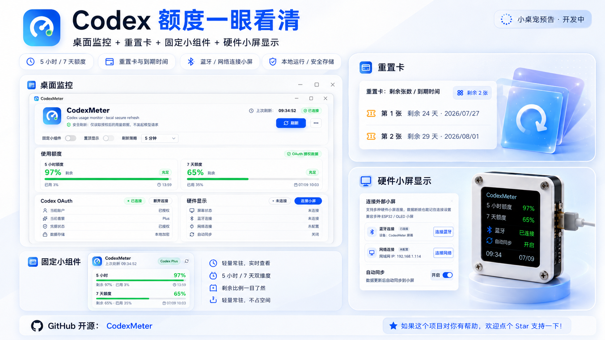

# CodexMeter

CodexMeter 是一个本地运行的 Codex 额度状态面板，支持查看 5 小时额度、7 天额度、重置时间、额度重置卡，并提供桌面悬浮球。


<p align="center">
  
</p>

## 直接下载

如果只是想使用软件，不需要下载源码。

**Windows 用户推荐下载：**[CodexMeter v0.1.1 Windows 便携版](https://github.com/MrWanCC/CodexMeter/releases/download/v0.1.1/CodexMeter-v0.1.1-win-x64-portable.exe)

macOS 用户进入 [v0.1.1 软件版 Release](https://github.com/MrWanCC/CodexMeter/releases/tag/v0.1.1) 下载 `.dmg`：

- Apple 芯片：`CodexMeter-v0.1.1-software-mac-arm64.dmg`
- Intel 芯片：`CodexMeter-v0.1.1-software-mac-x64.dmg`

> GitHub Release 页面里的 `Source code (zip)` 和 `Source code (tar.gz)` 是源码包，不是普通用户运行的软件。

| 版本 | 适合用户 | 平台 | 下载 |
| --- | --- | --- | --- |
| 软件版 | 只想在电脑本地查看 Codex 额度 | Windows / macOS | [Windows 便携版](https://github.com/MrWanCC/CodexMeter/releases/download/v0.1.1/CodexMeter-v0.1.1-win-x64-portable.exe) / [macOS Release](https://github.com/MrWanCC/CodexMeter/releases/tag/v0.1.1) |
| 硬件版 | 需要连接 ESP32-C3 OLED 小屏 | Windows | [CodexMeter v0.1.0 硬件版](https://github.com/MrWanCC/CodexMeter/releases/tag/v0.1.0-hardware) |

更多下载说明见 [downloads/README.md](downloads/README.md)。

## 软件版功能

- 查看 5 小时额度和 7 天额度
- 查看重置时间和额度重置卡
- OAuth 连接或断开 Codex 账号授权
- 默认 1 分钟自动刷新
- 桌面悬浮球展示核心额度状态
- 本地保存授权信息，不上传 Token

## 硬件版说明

硬件版用于把额度状态推送到 ESP32-C3 OLED 小屏，支持蓝牙和 HTTP 推送。

- 推荐硬件：ESP32-C3 Mini + SSD1306 128x64 OLED
- Web 刷机：[ESP32-C3 Web Flasher](https://mrwancc.github.io/CodexMeter/flash/)
- 完整教程：[docs/hardware.md](docs/hardware.md)

## 开发运行

环境要求：

- Node.js 20+
- npm
- Windows 10/11 或 macOS

```powershell
git clone https://github.com/MrWanCC/CodexMeter.git
cd CodexMeter
npm install
npm run dev
```

常用命令：

```powershell
npm run test
npm run build
npm run dist:portable
```

构建产物输出到 `release/` 目录。

## 安全说明

- 不发起模型请求
- 不采集聊天内容
- 不把 OAuth Token 提交到第三方服务
- 授权数据只保存在本机
- `.env`、本地缓存和构建产物不提交到仓库

## License

本项目采用自定义非商业许可证：

- 可以学习
- 可以个人直接使用
- 可以非商业二次开发
- 不允许商业使用

完整条款见 [LICENSE](LICENSE)。
