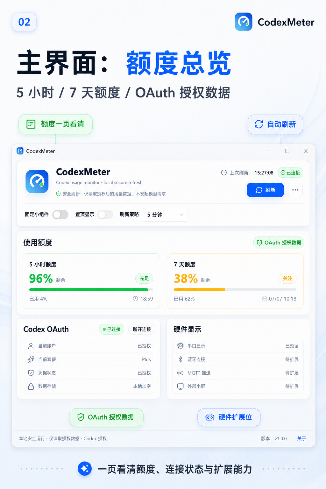
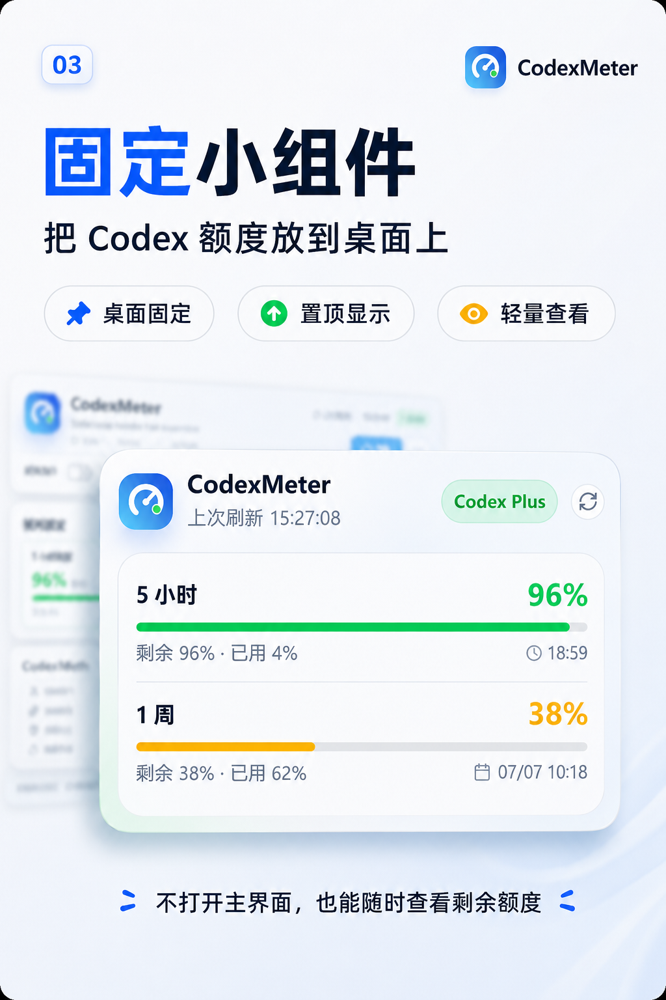
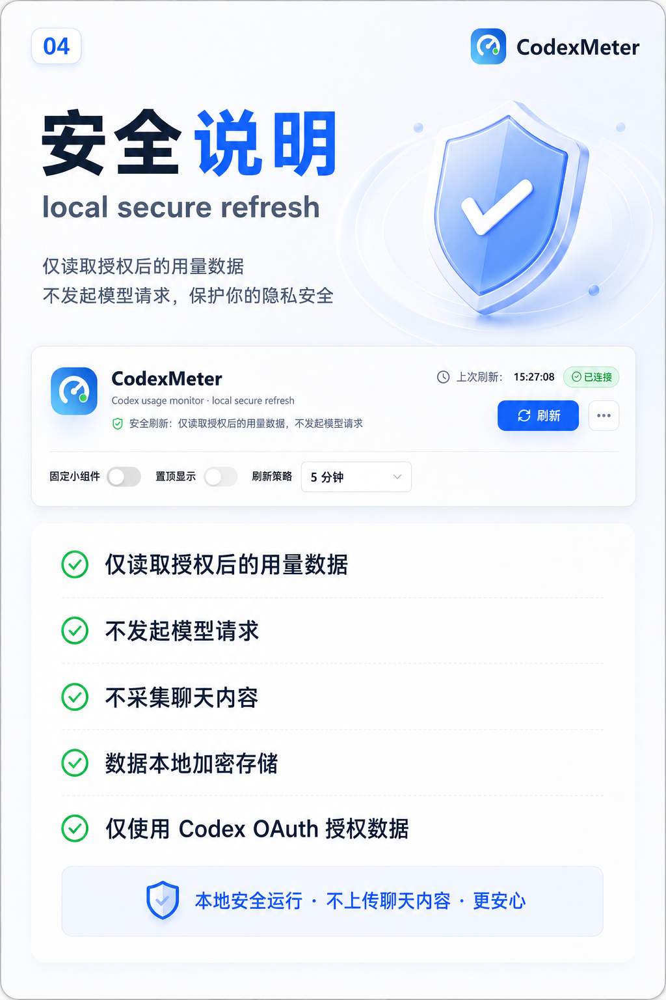
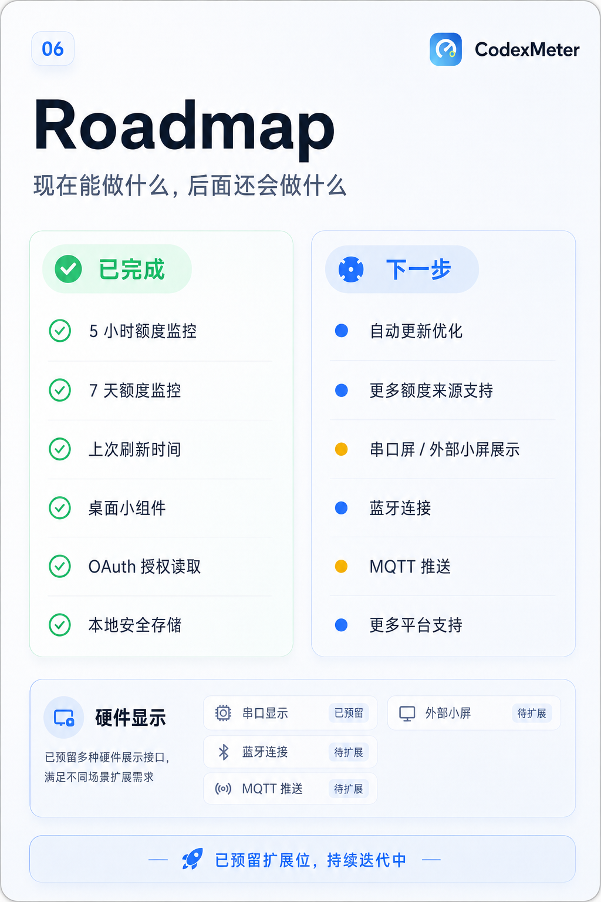

# CodexMeter


本地运行的 Codex 用量监控桌面工具，支持 5 小时 / 7 天额度、重置时间、桌面小组件和本地安全存储。

<p align="center">
  
</p>

## 直接下载

不想研究源码，可以直接下载桌面版。现在分为两个版本：

**软件版**<br>
适合只在电脑上查看 Codex 额度的用户。<br>
平台：Windows / macOS<br>
[下载 CodexMeter v0.1.0 软件版](https://github.com/MrWanCC/CodexMeter/releases/tag/v0.1.0)

**硬件版**<br>
适合需要连接 ESP32-C3 OLED 小屏的用户。<br>
平台：Windows<br>
支持：蓝牙 / HTTP 推送<br>
[下载 CodexMeter v0.1.0 硬件版](https://github.com/MrWanCC/CodexMeter/releases/tag/v0.1.0-hardware)

也可以查看仓库内的 [downloads/README.md](downloads/README.md)。

## 功能特性

- 实时监控 5 小时额度使用情况
- 实时监控 7 天额度使用情况
- 显示重置时间倒计时
- 桌面小组件，可固定、置顶显示
- OAuth 授权读取用量数据
- 本地安全存储授权信息
- 不发起模型请求，不采集聊天内容
- 硬件版支持 ESP32-C3 OLED 小屏
- 硬件版支持蓝牙和 HTTP 两种推送方式
- 硬件版支持 ESP32-C3 Wi-Fi 配网页

## 项目截图

<p align="center">
  
  
</p>

<p align="center">
  
  
</p>

## 安全说明

CodexMeter 的目标是做一个本地辅助工具：

- 不发起模型请求
- 不采集聊天内容
- 不提交 OAuth Token 到第三方服务
- 授权数据保存在本机
- `.env`、本地缓存、构建产物不会提交到仓库

项目会读取当前授权下的用量相关接口。相关接口可能随官方产品变化而调整，如果后续失效，欢迎提交 Issue 或 PR。

## 开发运行

环境要求：

- Node.js 20+
- npm
- Windows 10/11

```powershell
git clone https://github.com/MrWanCC/CodexMeter.git
cd CodexMeter
npm install
npm run dev
```

常用命令：

```powershell
npm run test
npm run build
npm run dist:portable
```

打包后的文件会输出到 `release/` 目录。

## 技术栈

- Electron
- Vue 3
- TypeScript
- Vite
- Naive UI
- lucide-vue-next
- electron-store
- electron-builder
- Vitest

## 项目结构

```text
src/
  main/       Electron 主进程、OAuth、用量数据读取
  preload/    安全暴露给渲染进程的 IPC 接口
  renderer/   Vue 页面、小组件和样式
  shared/     主进程与渲染进程共享类型和解析逻辑
tests/        单元测试和 UI 尺寸回归测试
docs/         使用说明和展示图片
downloads/    可直接使用的成品说明和便携版
```

## 使用说明

更完整的使用说明见 [docs/USER_GUIDE.md](docs/USER_GUIDE.md)。

## 硬件显示

硬件联动开发在 `hardware-software` 分支继续推进，当前目标是 ESP32-C3 Mini 通过 Wi-Fi 接收桌面端 HTTP 推送。

文档见 [docs/hardware/README.md](docs/hardware/README.md)。

## Roadmap

- 更稳定的自动更新方案
- 硬件显示设备同步
- 更多额度来源兼容
- 更完整的发布包和安装指引
- 多语言文档

## 贡献

欢迎提交 Issue、建议和 PR。这个项目适合学习 Electron 桌面应用、OAuth 数据读取、本地安全存储和桌面小组件 UI。

如果这个项目对你有帮助，欢迎点一个 Star。

## License

本项目采用自定义非商业许可：

- 可以学习
- 可以个人直接使用
- 可以非商业二次开发
- 不允许商用

完整条款见 [LICENSE](LICENSE)。
