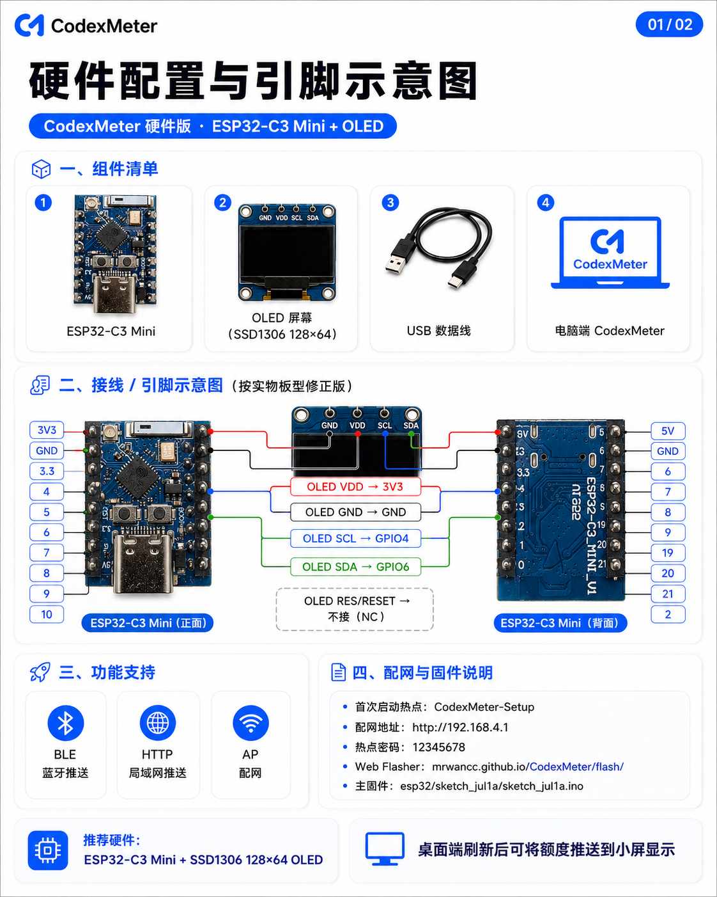
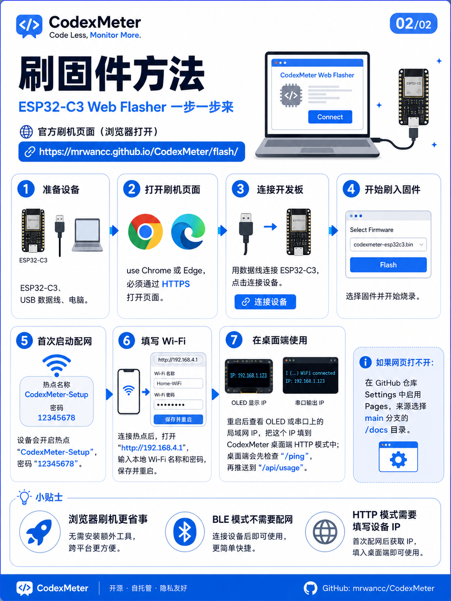
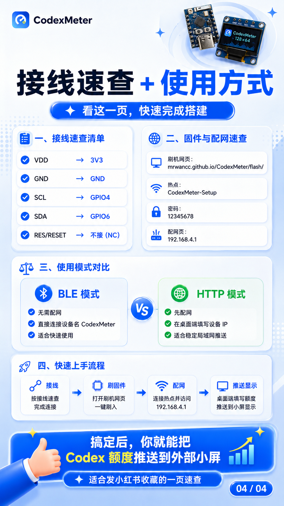

# CodexMeter 硬件版快速上手

本文用于 ESP32-C3 Mini + SSD1306 OLED 小屏的接线、刷固件、配网和桌面端连接。

## 硬件清单

- ESP32-C3 Mini 开发板
- SSD1306 OLED 屏幕，128x64，I2C 接口
- USB 数据线
- 电脑端 CodexMeter 硬件版

## 接线

按下面方式连接 OLED 与 ESP32-C3 Mini：

| OLED 引脚 | ESP32-C3 Mini |
| --- | --- |
| VDD | 3V3 |
| GND | GND |
| SCL | GPIO4 |
| SDA | GPIO6 |
| RES / RESET | 不接 |

  

## 刷入固件

1. 使用 Chrome 或 Edge 打开刷机网页：  
   <https://mrwancc.github.io/CodexMeter/flash/>
2. 用 USB 数据线连接 ESP32-C3 Mini。
3. 点击网页中的连接 / 安装按钮，选择 ESP32-C3 对应串口。
4. 等待固件写入完成。
5. 如果浏览器看不到串口，按住开发板 `BOOT` 后重新插入 USB，再重试。

  

## 首次配网

刷机后设备会开启配网热点：

- 热点名称：`CodexMeter-Setup`
- 热点密码：`12345678`
- 配网页：`http://192.168.4.1`

连接热点后，在浏览器打开 `http://192.168.4.1`，填写本地 Wi-Fi 名称和密码，保存并重启。重启后 OLED 或串口会显示局域网 IP。

## 使用方式

CodexMeter 硬件版支持两种推送方式：

| 模式 | 适合场景 | 使用方式 |
| --- | --- | --- |
| BLE 蓝牙 | 快速连接，不想配网 | 在桌面端连接设备名 `CodexMeter` |
| HTTP 网络 | 稳定局域网推送 | 在桌面端填写设备 IP |

桌面端刷新额度后，会把 5 小时额度、7 天额度、蓝牙状态、自动同步状态推送到 OLED 小屏。

  

## 常见问题

### 浏览器找不到设备

- 使用 Chrome 或 Edge。
- 确认 USB 线支持数据传输。
- 关闭 Arduino IDE 串口监视器、串口助手等占用串口的软件。
- 按住 `BOOT` 后重新插入 USB，再点击连接。

### 小屏没有显示

- 检查 OLED 是否为 SSD1306 128x64 I2C。
- 检查接线是否为 `VDD->3V3`、`GND->GND`、`SCL->GPIO4`、`SDA->GPIO6`。
- 重新上电 ESP32-C3。

### HTTP 模式连接不上

- 确认电脑和 ESP32-C3 在同一个局域网。
- 用浏览器访问 `http://设备IP/ping`，正常应返回在线状态。
- 在桌面端填写设备 IP，不需要填写端口。

